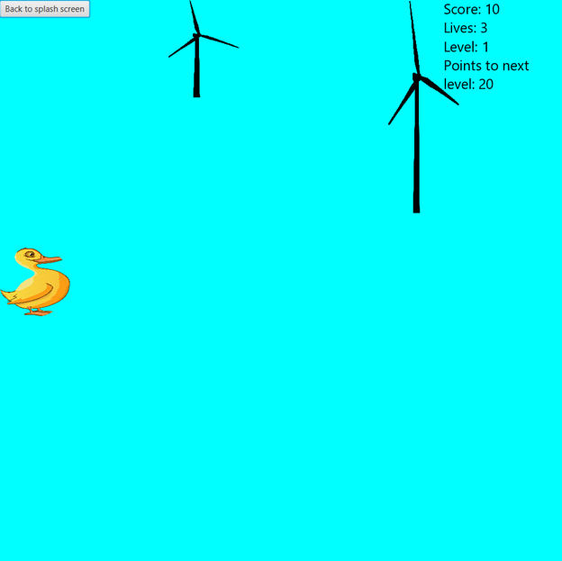

# interactive-renewable-energy
Code created as part of the HackDuke hackathon. Creates an interactive way of learning about renewable energy designed for younger children. 

### Running
####  Instructions
NOTE: This readme is a work in progress along with this project
0. Download OpenJDK **full** package [here](https://bell-sw.com/pages/downloads/#/java-14-current). Download OpenJFX [here](https://openjfx.io/). 
1. Clone the git repository at [github.com/gllewellyn19/interactive-renewable-energy](https://github.com/gllewellyn19/interactive-renewable-energy)
2. Open your terminal and navigate into the cloned repository
3. Run `cd out/artifacts/interactive_renewable_energy_jar`
4. Run the command: `java -jar interactive-renewable-energy.jar`

### Cheat codes:
#### General: 
* B- takes you back to the splash screen

#### Animation:
* N- takes you to the next animation

#### Game:
* H- Pauses/ unpauses the game. If the user tries to move their piece, the game will unpause.
* R- Restarts the game
* L- skips to the next level

### Sources:
Free pictures from: [https://pixabay.com/photos/search/](https://pixabay.com/photos/search/)
[Hydro generator picture](https://www.usgs.gov/media/images/a-turbine-connected-a-generator-produces-power-inside-a-dam)
[How hydroelectric power works](https://www.usgs.gov/special-topic/water-science-school/science/hydroelectric-power-how-it-works?qt-science_center_objects=0#qt-science_center_objects)
[How solar works](https://www.livescience.com/41995-how-do-solar-panels-work.html#:~:text=Simply%20put%2C%20a%20solar%20panel,smaller%20units%20called%20photovoltaic%20cells.&text=This%20all%20adds%20up%20to,junction%20between%20the%20silicon%20layers.)
[Solar fun facts](https://www.energy.gov/articles/top-6-things-you-didnt-know-about-solar-energy#:~:text=Solar%20energy%20is%20the%20most,by%20Bell%20Laboratories%20in%201954.)
[Wind fun facts](https://www.opusenergy.com/blog/13-little-known-facts-about-wind-energy/)
[Hydroelectric fun facts](https://www.energy.gov/articles/top-10-things-you-didnt-know-about-hydropower)
[Renewabler energy cartoon splash screen](https://www.nationalgeographic.org/activity/right-balance-mixing-energy-resources/)